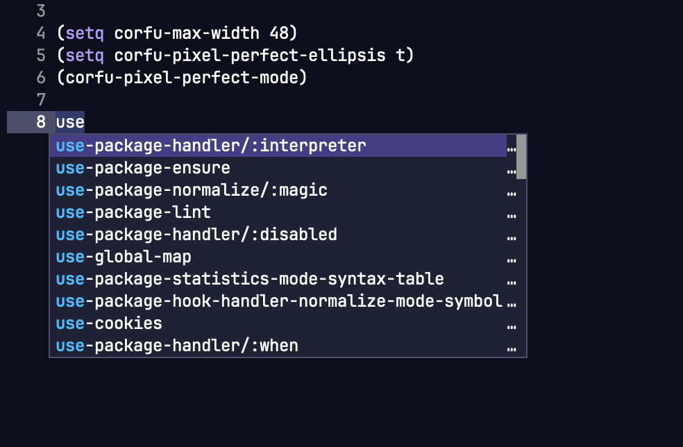
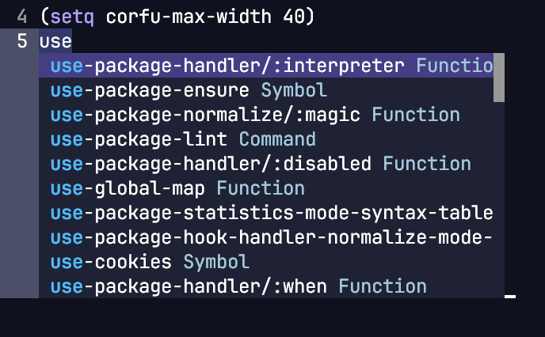
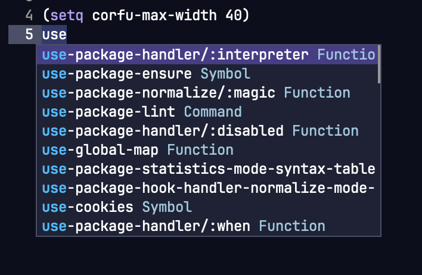

# corfu-pixel-perfect

corfu-pixel-perfect allows the use of variable fonts, emojis and images in Corfu
while still maintaining perfect pixel alignment of the popup content with
virtually no performance degradation in real life.

## Why?

As software professionals, the completion popup is one of the most important UI
elements in an editor, we look at it probably as much as we look at the code
itself. However, we are also Emacs users, and historically the Emacs ecosystem
has a tendency to use one single monospaced font for both the UI and the text
documents for no better reason than "I occasionally use Emacs in the terminal",
or "that's something every package forces on me". While I can't possibly comment
on your life choices, I claim your font choice need not be an all-or-nothing
binary choice (since Emacs 29).

But why would you like to use anything other than a monospaced font? I hear you
ask.

I very much like monospaced fonts, in fact I like them so much, I'd like to use
more than one kind of monospaced fonts, or a different height of the same
monospaced font, or occasionally commit the sin of using a variable font for the
less important things such as annotation. Unfortunately, even in 2024, these
font adjustments are still impossible to use in many Emacs packages, because
they still treat every glyph as having the exact same size, one such example is
`corfu`.

With `corfu-pixel-perfect`, you can finally have perfect pixel alignment in your
favorite auto-completion popup.


## Usage

``` emacs-lisp
(use-package corfu)
(use-package corfu-pixel-perfect
 :quelpa (corfu-pixel-perfect :fetcher github :repo "wyuenho/emacs-corfu-pixel-perfect")
 :after (corfu)
 :hook (global-corfu-mode . corfu-pixel-perfect-mode))
```


## Problems solved

### Prefix icon misalignment due to the icons having different widths than the default face font

| corfu | corfu-pixel-perfect |
|-------|---------------------|
|||


### Variable fonts causes misalignment of the annotations and the scroll bar

| corfu | corfu-pixel-perfect |
|-------|---------------------|
|||


### Misalignment due to faces using the same font but in different heights

| corfu | corfu-pixel-perfect |
|-------|---------------------|
|||


### Emoji causing misalignment and erroneous popup height calculation

| corfu | corfu-pixel-perfect |
|-------|---------------------|
|||


## New Features

### Ellipsis to indicate additional text being clipped

Currently `corfu` does not offer users any indication when the completion text
is truncated. This presents a usability problem when your `corfu-max-width`
happens to land around where the candidates end.


| corfu | corfu-pixel-perfect |
|-------|---------------------|
||

Just set `corfu-pixel-perfect-ellipsis` to `t` to enable the new behavior with
the same performance.

As a sidenote, this option will necessitate moving the scroll bar to the margin,
which has a minimum width of 1 column. This is a tradeoff between usability,
performance and beauty. I chose to give up beauty on this one.

As to the column of ellipsis, coming from outside of Emacs, this may seem
strange to you, and I agree, but this behavior is at least somewhat consistent
with Emacs's default behavior. Emacs shows a whole column of bitmap right arrows
on a GUI and $ on the terminal when clipping a table of padded text. Let me know
if you hate it, I think there's enough performance headroom in the usual case to
make the ellipsis less intrusive.


### VS Code style annotations


This new option offers an even more distraction-free experience for those who
like to peruse the names of the candidates before narrowing down a selection by
its signature.

To enable this feature, put the major mode(s) you'd like the annotations hidden
into `corfu-pixel-perfect-ignore-annotation-modes`.

``` emacs-lisp
(use-package corfu-pixel-perfect
  ...snip...
  :custom
  (corfu-pixel-perfect-ignore-annotation-modes '(emacs-lisp-mode)))
```

As a bonus, this feature actually *increases* performance to be as fast as
vanilla `corfu`.


## Future improvements

### Much simpler terminal mode

Currently, due to how `corfu` programmatically truncates strings, downstream
packages or user customizations, even in situations where every glyph has
exactly the same width, may still exhibit surprising effects such as this:




The above screenshot was captured using
[`corfu-terminal`](https://codeberg.org/akib/emacs-corfu-terminal). While some
may argue this is useful, I would content this is very distracting, especially
in cases where the annotations do not contain much useful information and can
reasonably be clipped.

There is a plan to offer a much simpler `corfu-pixel-perfect-terimal-mode`
tailored to uniform glyph width situations while respecting the API signatures
and the constraints upstream, stay tuned.


### Column-wise truncation

The text inside the completion popup is basically a table of 3 columns - prefix,
candidate, and annotations. Given the individual cell contents can differ in
length wildly, and differ in significance, always truncating from the end of the
annotations may not suit every situation. This is especially true when working
in a statically typed programming language such as Rust or TypeScript in LSP
mode. The signature of a function is often just as, if not more important than
the name. If a few overly long functions such as
`myComponetSuperSecret__DangerouslySetInnerHTML` causes the candidate column to
suddenly increase in width greatly, the function signatures may overflow behind
the window due to `corfu-max-width` being exceeded. It is perhaps preferrable to
first truncate the candidates in this situation.


### Truncation indicator other than a column of ellipsis

While `corfu-pixel-perfect-ellipsis` tells you the completions text are clipped
behind the window, it's also rather intrusive. I think *some* indicator for
clipped text is needed, but it doesn't need to be a column of ellipsis. Let me
know if you have some idea on how best to present this in the popup.


### Intelligent popup width adjustment

Currently `corfu-min-width` defaults to 15, which is too low for most cases, and
`corfu-max-width` defaults to 100, which is too large for most cases. So, for
most cases, the popup width flickers wildly between 85 columns as you scroll,
depending on which programming languages you work with. However, since different
programming languages differ in verbosity, you don't really know what the best
widths to set are, so you end up constantly messing with these variables. This
situation is exacerbated by the fact `corfu` does not remember the size after
resizing the popup with a mouse.

There must be some simple clever math you can do to guess a sensible static
width depending on the major mode and past completion invocations. Or perhaps,
just simply remembering the size of the popup after the user has resized it with
a mouse.


### Real scrollable popup?

Have you noticed the completion popup does not respond to mouse scroll or
dragging on the "scroll bar"? Yeah, the sacrifaces we made for sticking with
Emacs sometimes border on the absurd.

However, this is perhaps a blue sky project in its own right, largely due to
performance reasons :( Emacs is lovely like that.


### Misc fixes

1. Margin formatter returning an empty string no longer deletes the left
   padding.
2. When there aren't enough candidates to show a scroll bar,
   `corfu-right-margin-width` is no longer ignored.
3. `corfu-bar-width` is no longer ignored when it is larger than
   `corfu-right-margin-width`.
4. Various negative width and divide by zero issues.
5. Popup height is also now pixel perfect.


I'll document in detail all of these relatively minor issues in due course.


## Performance

Before you read on, I would like you to ask yourself a question - how many times
per second can you type a letter, scroll and read through a list of selections,
make a selection decision, and then type enter? If you can do this more than a
few times per second continuously for more than a couple of seconds at a time,
are you sure you need an auto-completion UI? If your answer is yes to both
questions, then read on.

On a MacBook Pro M1 Pro from 2021, a benchmark is conducted using on Emacs 29
compiled with `--with-native-compilation=aot` turned on and my daily
configuration which consists of 177 installed packages with over 2 dozens
functions in my `post-command-hook`. Using all default settings for `corfu` and
`corfu-pixel-perfect` except a rather extreme `corfu-count` of 100,
`corfu--candidates-popup` is called with 100 completion strings each having 100
glyphs 720 times per trial for 10 trials.

With vanilla `corfu`, it finishes in around 7.87s to 8.23s, equivalent to around
89 FPS. `corfu-pixel-perfect`finishes in 8.22s to 8.57s, equivalent to around 85
FPS. The higher variability of performance with vanilla `corfu` is due to
programmatic truncation using `truncate-string-to-width` triggering some amount
of GCs. `corfu-pixel-perfect` by default does not use any kind of programmatic
string truncation, but simply rely on the window system to clip the text that is
longer than your `corfu-max-width` value. In summary, `corfu-pixel-perfect` is
just 5% slower than `corfu` in extreme cases. `corfu`'s performance is more
variable, whereas `corfu-pixel-perfect` is the opposite.

In reality, with a reasonable `corfu-count` such as 20, both implementations
easily exceed 260 frames per second. Therefore, for any perceived slowdown, the
culprit is far more likely to be your `completion-at-point` function. If not,
please do let me know.

You can eval this [benchmark](benchmark/benchmark.el) to see for yourself.


## How does corfu-pixel-perfect work?

For a long time, Emacs has had pixel-wise string alignment facilities in the
form of display text properties and a very cumbersome function called
`window-text-pixel-size`. What has been missing was, a performant way to measure
text sizes in pixels due to `window-text-pixel-size`'s requirement for a window
and a temporary buffer for every measurement. The situation has improved a bit
with the introduction of a `buffer-text-pixel-size` C function in Emacs 29, and
a new `string-pixel-width` Elisp function that uses it.

In addition, Emacs now offers a function called `string-glyph-split` that will
respect text properties, faces and composed characters such as emojis, so Elisp
programmers can now truncate strings more accurately should we choose to.

With these new capabilities, Elisp programs can finally measure glyph widths in
pixels with acceptable performance in most circumstances.

While this package currently does not use `string-glyph-split`, as it opts out
of programmatic truncation in favor of clipping by the window system for
performance reasons, there is enough performance headroom in this package to
offer opt-in features such as column-wise truncation and fancier column
alignment and formatting. These features will be progressively rolled out in the
future.

In conclusion, by employing `string-pixel-width` in combination with `corfu`'s
excellent extension points via `cl-defmethod`, sprinkle in a couple of
`advice-add`, refactoring some code in order to redo some of the width
calculations while avoiding relative alignment and programmatic truncation, the
result of this package is achieved.


## FAQ

### Why wasn't this upstreamed?

The usual combination of reasons in open source :)

Without getting too personal, the technical hangup seems to be around a
combinations of 1) perceived performance degradation, of which I've proven to be
inconsequential above. 2) incompatibility with Emacs <= 28, of which I dismiss
as irrelevant because the original PR could easily be molded into an extension
that requires Emacs >= 29, as demonstrated in a separate PR and here, 3)
"sacrificing existing styling" that is hostile to accessibility and usablity, by
offering an option for the users to *opt into*, and most centrally, 4) around a
collaborator claiming the following as a feature that regressed, despite the
author acknowledging it was never intended, and both agreeing it was not ideal,
but the author still insisting "the current alignment works better". [^1]

 [^2]


There are a number of other reasons for the rejection of the change I'm sure,
but they are not about techincal merit, of which I'll stick to here.

In short, I regret not publishing all these improvements as a separate package
first in order to gather some community feedback before attempting to land
multiple medium size changes. This is my mistake, of which I'm fixing by
publishing this new package.


[^1]: While I do see some utility in this coincidence due to higher information
  density, after some consideration, I have decided against it and its
  right-align-at-best-effort variant for now. The reason is downstream Elisp
  programs rely on the output of `corfu--format-candidate`. It's easy to pad and
  format 3 columns into a list of strings in imaginative ways, it's much harder
  to parse and reformat irregularly formatted strings without abusing text
  properties, or worse, using a parser. The design space for completion popup
  column alignment is actually quite large. I may revisit some options to chain
  formatters after taking inspiration from other IDEs. For now, I think keeping
  the formatted output simple and predictable is the best course of action as
  the API remains composable.

[^2]: Which has since been altered a few days after the PR was closed, to take a
  similar approach first used in this package, but still programmatically
  truncates, without allowing the user to expand the popup frame with a mouse to
  see the clipped annotation. While this is admittedly an improvement, this
  right-align-at-best-effort approach still causes problems for downstream Elisp
  programs due to its irregularity, nevermind the result is just as distracting.
  When `corfu-max-width` is lowered, more lines are truncated in seemingly
  random order while the rest has their annotations floating in inexplicably. An
  example can be seen [here](#much-simpler-terminal-mode).


### Were there any issues filed on `corfu` regarding the bugs found?

Some of the problems illustrated here had been raised, but I did not file any
issues.

This is to honor `corfu` author's request to not file many issues based on a
private conversation. Regardless, I think you'll see a pattern on how he deals
with issues by glancing over his repos. I do not intend to cause any additional
stress for him.


### Will this be ported to Company?

Probably not by myself. Time is a very precious resource, and Company has
accumulated too much code bloat over the years for this to be a worthwhile
adventure for me. However, an intrepid explorer such as you may find the ideas
in this package promising. If that's the case, plese feel free to take the ideas
and/or code to do whatever you want in whatever package, provided you adhere to
the GPLv3 license.


### Will this be published on a package archive?

Eventually, likely, hopefully soon. But it'll definitely not be Gnu ELPA or
Non-Gnu ELPA despite they are technically superior than Melpa when it comes to
versioning. This is a personal choice I've made some years ago. Time is a very
precious resource for me.


### Are there bugs introduced?

Although I do not anticipate many, I do expect a few. Emacs has a lot of
different GUI frontends and they all vary to some degree. The tricks used here
may not work for you, despite adhering to the documentation to my best
effort. If you've found a bug, file an issue and I'll do my best to fix it, but
please do not file a bug against the Haiku, Andriod or MS-DOS port.


### Will this package break when `corfu` changes its API?

`corfu`'s API has been relatively stable for sometime, while I cannot control
what develops over there, I can promise as soon as something breaks, I'll fix
it. A usable, performant and correct auto-completion UI is very important to me
as I use it every day, maintaining stability in this package is a priority for
me by default.


### Which version of Emacs does this package support?

Emacs 29. It's possible to adapt this package for Emacs < 29 without much
effort, but ideally the responsibility lies in
[compat](https://github.com/emacs-compat/compat) in that it needs to provide a
`string-pixel-width`. However, I expect the performance will take some hit if
you aren't on Emacs >= 29.
