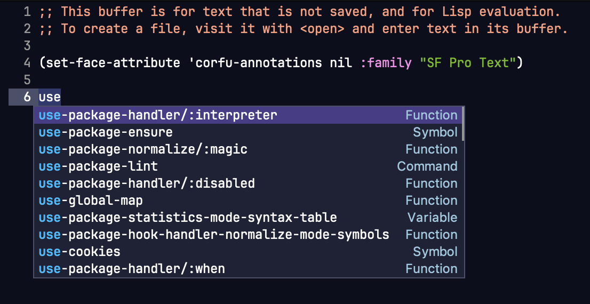
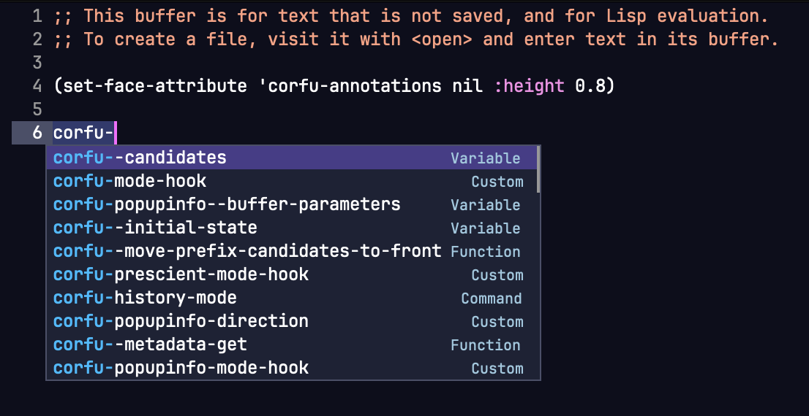
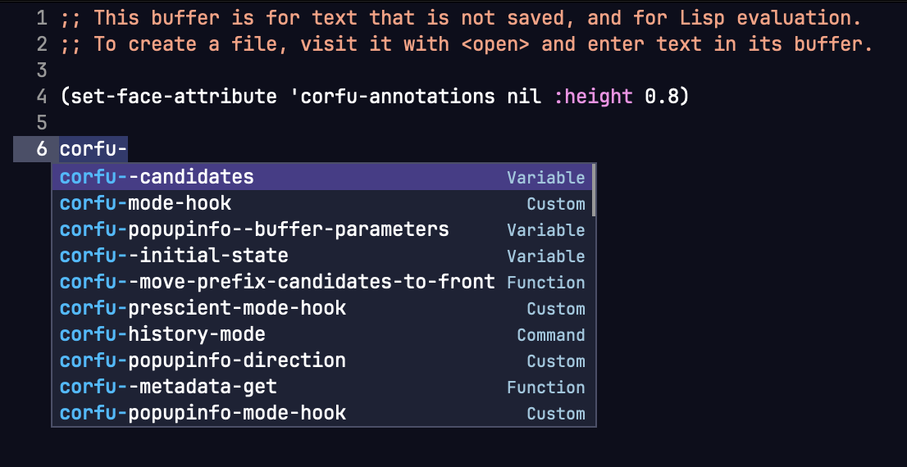
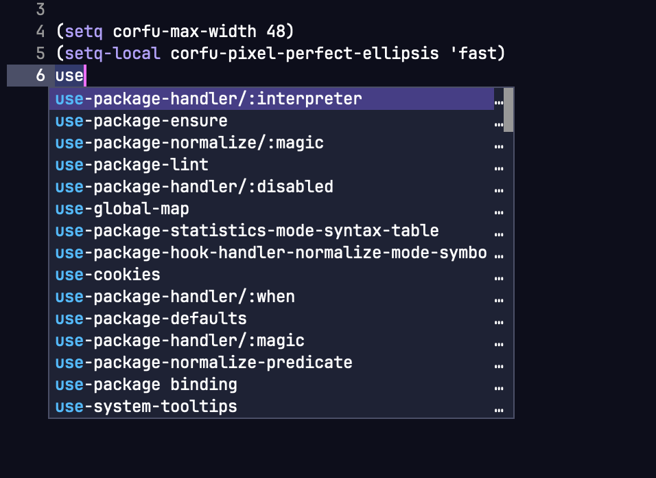

# corfu-pixel-perfect

corfu-pixel-perfect allows the use of variable fonts, emojis and images in Corfu
while still maintaining perfect pixel alignment of the popup content with
virtually no performance degradation in real life.

## Why?

As software professionals, the completion popup is one of the most important UI
elements in an editor, we look at it probably as much as we look at the code
itself. However, we are also Emacs users, and historically the Emacs ecosystem
has a tendency to use one single monospaced font for both the UI and the text
documents for no better reason than "I occasionally use Emacs in the terminal",
or "that's something every package forces on me". While I can't possibly comment
on your life choices, I claim your font choice need not be an all-or-nothing
binary choice (since Emacs 29).

But why would you like to use anything other than a monospaced font? I hear you
ask.

I very much like monospaced fonts, in fact I like them so much, I'd like to use
more than one kind of monospaced fonts, or a different height of the same
monospaced font, or occasionally commit the sin of using a variable font for the
less important things such as annotation. Unfortunately, even in 2024, these
font adjustments are still impossible to use in many Emacs packages, because
they still treat every glyph as having the exact same size, one such example is
`corfu`.

With `corfu-pixel-perfect`, you can finally have perfect pixel alignment in your
favorite auto-completion popup.


## Usage

``` emacs-lisp
(use-package corfu)
(use-package corfu-pixel-perfect
 :quelpa (corfu-pixel-perfect :fetcher github :repo "wyuenho/emacs-corfu-pixel-perfect")
 :after (corfu)
 :hook (global-corfu-mode . corfu-pixel-perfect-mode))
```


## Problems solved

### Prefix icon misalignment due to the icons having different widths than the default face font

| corfu | corfu-pixel-perfect |
|-------|---------------------|
|||


### Variable fonts causes misalignment of the annotations and the scroll bar

| corfu | corfu-pixel-perfect |
|-------|---------------------|
|||


### Misalignment due to faces using the same font but in different heights

| corfu | corfu-pixel-perfect |
|-------|---------------------|
|||


### Emoji causing misalignment and erroneous popup height calculation

| corfu | corfu-pixel-perfect |
|-------|---------------------|
|||


## New Features

### VS Code style annotations


This new option offers an even more distraction-free experience for those who
like to peruse the names of the candidates before narrowing down a selection by
its signature.

To enable this feature, put the major mode(s) you'd like the annotations hidden
into `corfu-pixel-perfect-ignore-annotation-modes`.

``` emacs-lisp
(use-package corfu-pixel-perfect
  ...snip...
  :custom
  (corfu-pixel-perfect-ignore-annotation-modes '(emacs-lisp-mode)))
```

As a bonus, this feature actually *increases* performance to be as fast as
vanilla `corfu`.


### Ellipsis

Currently `corfu` does not offer users any indication when the completion text
is truncated. In situations where the annotation is just as important as the
completion candidate names, this default presents a usability problem when your
`corfu-max-width` happens to land around where the candidates end.


With `corfu-pixel-perfect`, you now have 3 new ways to choose how to retain the
most amount of useful information when the popup frame is too narrow, but
adjusting `corfu-max-width` may not be desirable.


#### Fast

``` emacs-lisp
(setopt corfu-pixel-perfect-ellipsis 'fast)
```

This option will move the scroll bar to the margin, and present a column of
ellipsis at the last column of the text area to indicate additional text is
clipped behind the popup frame. This is the fastest option as it has no
detectable performance impact.



As a sidenote, since the margin has a minimum width of 1 column, the thinnest
scroll bar will be 1 column. This is a necessary tradeoff between usability,
performance and beauty. Since this is a purely utlitarian option, beauty is
sacrificed.

This is the recommended option if the other two options are too slow for you,
but would still like some kind of truncation indication.


#### Annotation First

``` emacs-lisp
(setopt corfu-pixel-perfect-ellipsis 'annotation-first)
```

This option puts the scroll bar back on the fringe, but uses a slower, yet still
generally performant way to replace the portion of the content that exceeds
`corfu-max-width` with ellipses. This option only places the ellipses on the
elided lines, starting from the end.


This is the recommended option if absolute performance is not paramount, `fast`
is too distracting for you, and when the active `completion-at-point` function
does not present much useful information, and thus can reasonably be clipped
off.


#### Proportional

``` emacs-lisp
(setopt corfu-pixel-perfect-ellipsis 'proportional)
```

This option places the ellipses on both the candidate and the annotation
columns. The elided portions in each column is proportional to the width of the
column. This option preserves the most information.


This is the recommended option if absolute performance is not paramount, `fast`
is too distracting for you, and when you are working with a programming language
where the signature of a function is as important as the candidate name.


Finally, it is important to note that `corfu-pixel-perfect-ellipsis` is a
buffer-local variable, therefore you can set it to a value most suitable for the
major mode in its mode hook, and that value will only affect buffers created in
that major mode.


``` emacs-lisp
(add-hook 'python-ts-mode-hook
  (lambda ()
    (setq-local corfu-pixel-perfect-ellipsis 'annotation-first)))

(add-hook 'go-ts-mode-hook
  (lambda ()
    (setq-local corfu-pixel-perfect-ellipsis 'proportional)))
```


### Mouse Interactivity

Sometimes, the mouse is faster than the keyboard, because Emacs.

#### Resize

<iframe width="560" height="315" src="https://www.youtube-nocookie.com/embed/39Lo2s_FG2A?si=qq6iogyA1qsLTtiO" title="YouTube video player" frameborder="0" allow="accelerometer; autoplay; clipboard-write; encrypted-media; gyroscope; picture-in-picture; web-share" referrerpolicy="strict-origin-when-cross-origin" allowfullscreen></iframe>

## Future improvements

### Treesitter-based candidate and annotation formatting

Some IDEs such as JetBrain's IntelliJ IDEA are able to parse out the parameters
and return type from a function signature, format the candidate column by
appending the parameters to the method names, while leaving the annotation
column with only the return type. For programming languages with long function
signatures, this seems to be the best way to present the columns.


Since `corfu-pixel-perfect` supplies a completely independent implementation of
all the functions in the call stack on top of `corfu--popup-show`, it has the
potential to offer total fine-grained control of candidate string formatting
before they are concatenated and sent to `corfu--popup-show` for rendering onto
a child frame. The only thing remains is to design a formatter API that can be
chained in a pipeline.


### Much simpler terminal mode

`corfu` currently does not have great support for running in the terminal. While
it has a generic method `corfu--popup-show` that downstream Elisp programs can
override, there's no guarantee what the formatting will be in the lines of
strings given as a parameter. Depending on the season, sometimes they are
truncated, sometimes they are formatted irregularly, downstream Elisp programs
simply cannot depend on it. As a result, the behavior of packages such as
`corfu-terminal` breaks all the time.

Similar to the above, since `corfu-pixel-perfect` have total control of
formatting, it therefore can guarantee the behavior of the input to
`corfu--popup-show`. In addition, the tricks used to achieve pixel precision
alignment in this package will automatically revert to treating every character
as uniform in widths. Combining both characteristics, this package can offer a
stable terminal mode with less than half the code of `corfu-terminal` while
providing the same or better result.


## Performance

Before you read on, I would like you to ask yourself a question - how many times
per second can you type a letter, scroll and read through a list, make a
selection decision, and then type enter? If you can do this more than a few
times per second continuously for more than a couple of seconds at a time, are
you sure you need an auto-completion UI? If your answer is yes to both
questions, then read on.

On a MacBook Pro M1 Pro from 2021, a benchmark is conducted on Emacs 29 compiled
with `--with-native-compilation=aot` launched without any flags. My daily
configuration consists of 177 installed packages with over 2 dozens functions in
`post-command-hook`. Using all default settings for `corfu` and
`corfu-pixel-perfect` except a rather extreme `corfu-count` of 100,
`corfu--candidates-popup` is called with 100 completion strings each having 100
glyphs consisting of a mix of icons, ASCII letters and emojis 720 times per
trial for 10 trials.

With vanilla `corfu`, it finishes in around 7.87s to 8.23s, equivalent to around
89 FPS. `corfu-pixel-perfect`finishes in 8.22s to 8.57s, equivalent to around 85
FPS. The higher variability of performance with vanilla `corfu` is due to
programmatic truncation using `truncate-string-to-width` triggering some amount
of GCs. `corfu-pixel-perfect` by default does not use any kind of programmatic
string truncation, but simply rely on the window system to clip the text that is
longer than your `corfu-max-width` value. In summary, `corfu-pixel-perfect` is
just 5% slower than `corfu` in extreme cases. `corfu`'s performance is more
variable, whereas `corfu-pixel-perfect` is the opposite.

In reality, with a reasonable `corfu-count` such as 20, both implementations
easily exceed 260 frames per second. Therefore, for any perceived slowdown, the
culprit is far more likely to be your `completion-at-point` function. If not,
please do let me know.

You can eval this [benchmark](benchmark/benchmark.el) to see for yourself.


## How does corfu-pixel-perfect work?

For a long time, Emacs has had pixel-wise string alignment facilities in the
form of display text properties and a very cumbersome function called
`window-text-pixel-size`. What has been missing was, a performant way to measure
text sizes in pixels due to `window-text-pixel-size`'s requirement for a window
and a temporary buffer for every measurement. The situation has improved a bit
with the introduction of a `buffer-text-pixel-size` C function in Emacs 29, and
a new `string-pixel-width` Elisp function that uses it.

In addition, Emacs now offers a function called `string-glyph-split` that will
respect text properties, faces and composed characters such as emojis, so Elisp
programmers can now truncate strings more accurately should we choose to.

With these new capabilities, Elisp programs can finally measure glyph widths in
pixels with acceptable performance in most circumstances.

While this package currently does not use `string-glyph-split`, as it opts out
of programmatic truncation in favor of clipping by the window system for
performance reasons, there is enough performance headroom in this package to
offer opt-in features such as column-wise truncation and fancier column
alignment and formatting. These features will be progressively rolled out in the
future.

In conclusion, by employing `string-pixel-width` in combination with `corfu`'s
excellent extension points via `cl-defmethod`, sprinkle in a couple of
`advice-add`, refactoring some code in order to redo some of the width
calculations while avoiding relative alignment and programmatic truncation, the
result of this package is achieved.


## FAQ

### Will this be ported to Company?

Probably not by myself. Time is a very precious resource, and Company has
accumulated too much code bloat over the years for this to be a worthwhile
adventure for me. However, an intrepid explorer such as you may find the ideas
in this package promising. If that's the case, plese feel free to take the ideas
and/or code to do whatever you want in whatever package, provided you adhere to
the GPLv3 license.


### Will this be published on a package archive?

Eventually, likely, hopefully soon. But it'll definitely not be Gnu ELPA or
Non-Gnu ELPA despite they are technically superior than Melpa when it comes to
versioning. This is a personal choice I've made some years ago. Time is a very
precious resource for me.


### Are there bugs introduced?

Although I do not anticipate many, I do expect a few. Emacs has a lot of
different GUI frontends and they all vary to some degree. The tricks used here
may not work for you, despite adhering to the documentation to my best
effort. If you've found a bug, file an issue and I'll do my best to fix it, but
please do not file a bug against the Haiku, Andriod or MS-DOS port.


### Will this package break when `corfu` changes its API?

`corfu`'s API has been relatively stable for sometime, while I cannot control
what develops over there, I can promise as soon as something breaks, I'll fix
it. A usable, performant and correct auto-completion UI is very important to me
as I use it every day, maintaining stability in this package is a priority for
me by default.


### Which version of Emacs does this package support?

Emacs 29. It's possible to adapt this package for Emacs < 29 without much
effort, but ideally the responsibility lies in
[compat](https://github.com/emacs-compat/compat) in that it needs to provide a
`string-pixel-width`. However, I expect the performance will take some hit if
you aren't on Emacs >= 29.
